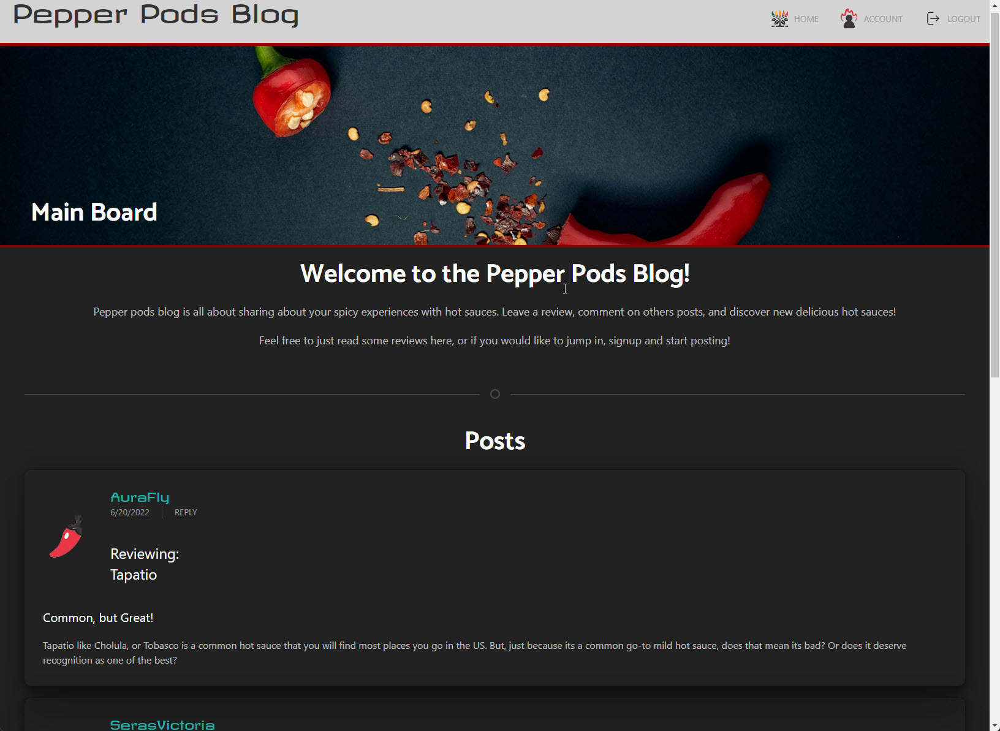

# Pepper_Pods_Blog

## Description:

My task is to build a CMS-style blog site similar to a Wordpress site, where developers can publish their blog posts and comment on other developers’ posts as well. I will build this site completely from scratch and deploy it to Heroku. My app will follow the MVC paradigm in its architectural structure, using Handlebars.js as the templating language, Sequelize as the ORM, and the express-session npm package for authentication.

I deviated with this slightly, but only with the content, I did not do a tech blog, instead I did a hot sauce blog to make this more my own thing.

## Table of Contents

- [Installation](#installation)
- [Usage](#usage)
- [Contribution](#contribution)
- [License](#license)
- [Git Info](#git-info)
- [Contact](#contact-me)

# Installation

Utilizes node and MySQL for database storage.
NPM packeges used:

- bcrypt: 5.0.1
- colors: 1.4.0
- connect-session-sequelize: 7.1.3
- dotenv: 16.0.1
- express: 4.18.1
- express-handlebars: 6.0.6
- express-session: 1.17.3
- formidable: 2.0.1
- mysql2: 2.3.3
- sequelize: 6.19.2
- sql-template-strings: 2.2.2

---

1. Clone repo
2. Run 'npm i'
3. In a mysql terminal, run 'source db/schema.sql'
4. Run node seeds/seed.js
5. Run npm start
6. In your browser open "http://localhost:3002/"

# Usage

Deployed site: https://pepperpodblog-app.herokuapp.com/

On the live site, you can do various things:

1. View all reviews made by active users from the homepage.
2. Signup or Login to existing account from login page.
3. From your account page, upload your own photo/avatar, post a new review, or delete or edit previous ones.
4. You can click on 'reply' to anyone's review to leave a comment as long as you are logged in, if you arent logged in, nothing will happen when you try.
5. More features coming soon!

# Contribution

Open to any and all contributions!

# Git Info

Username: AuraFly
https://github.com/AuraFly

# Contact Me

[Contact Me](mailto:auraflydev@gmail.com)

# License

This application is covered under the MIT open source license.

Permission is hereby granted, free of charge, to any person obtaining a copy of this software and associated documentation files, to deal in the Software without restriction, including without limitation the rights to use, copy, modify, merge, publish, distribute, sublicense, and/or sell copies of the Software, and to permit persons to whom the Software is furnished to do so, subject to the following conditions:

The above copyright notice and this permission notice shall be included in all copies or substantial portions of the Software.

THE SOFTWARE IS PROVIDED 'AS IS', WITHOUT WARRANTY OF ANY KIND, EXPRESS OR IMPLIED, INCLUDING BUT NOT LIMITED TO THE WARRANTIES OF MERCHANTABILITY, FITNESS FOR A PARTICULAR PURPOSE AND NONINFRINGEMENT. IN NO EVENT SHALL THE AUTHORS OR COPYRIGHT HOLDERS BE LIABLE FOR ANY CLAIM, DAMAGES OR OTHER LIABILITY, WHETHER IN AN ACTION OF CONTRACT, TORT OR OTHERWISE, ARISING FROM, OUT OF OR IN CONNECTION WITH THE SOFTWARE OR THE USE OR OTHER DEALINGS IN THE SOFTWARE.
